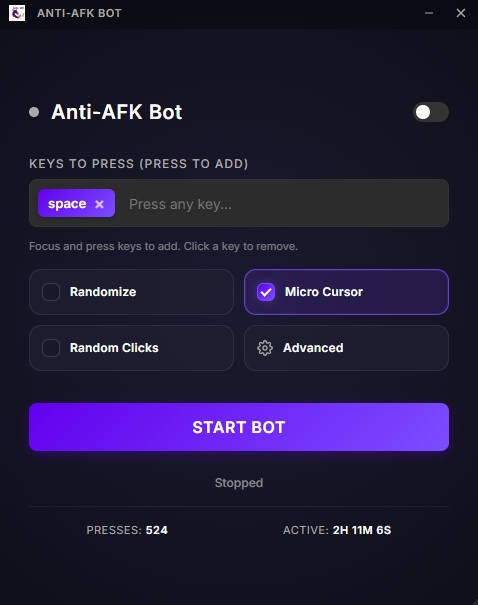

# 🤖 Anti-AFK Bot



[English](readme.md) | [Українська](README_UA.md) | [Русский](README_RU.md)

**Anti-AFK Bot** — це просте рішення для запобігання автоматичному відключенню (AFK) в іграх та програмах. Написаний на Python з використанням сучасних веб-технологій для інтерфейсу.

[](https://github.com/catgirl3d/game_antiafk_bot/releases/latest)
[](https://www.python.org/)

## ✨ Можливості

- **Декілька клавіш**: Налаштуйте декілька клавіш для випадкового натискання.
- **Випадкові інтервали**: Встановіть мін./макс. інтервали для природних варіацій часу.
- **Налаштовувана тривалість**: Контролюйте тривалість натискання клавіш для реалістичної поведінки.
- **Мікрорухи**: Опціональні ледве помітні рухи курсора для імітації активності.
- **Діапазон зсуву курсора**: Налаштуйте, на скільки пікселів мікрорухи можуть зміщувати курсор.
- **Випадкові кліки**: Опціональні випадкові кліки мишею для посиленого захисту від виявлення.
- **Автозбереження**: Запам'ятовує налаштування та положення вікна.
- **Статистика**: Показує кількість натискань та час роботи.
- **Поверх вікон**: Можна закріпити вікно поверх інших.
- **Мінімалізм**: Маленьке вікно без зайвих рамок.

## 🛠 Технологічний стек

- **Core**: Python 3.10+, `pyautogui`, `pywebview`.
- **UI**: HTML5, CSS3 (Vanilla), JavaScript (Vanilla).
- **Build**: PyInstaller, GitHub Actions.

## 🚀 Швидкий запуск

### З вихідного коду:

1. **Клонуйте репозиторій**:
   ```bash
   git clone https://github.com/catgirl3d/game_antiafk_bot.git
   cd game_antiafk_bot
   ```

2. **Встановіть залежності**:
   ```bash
   pip install -r requirements.txt
   ```

3. **Запустіть**:
   ```bash
   python main.py
   ```

## ⚙️ Налаштування клавіш

Бот підтримує як поодинокі символи, так і спеціальні клавіші:
- `space`, `f1`, `f12`, `shift`, `ctrl`, `alt`, `enter` та ін.
- Повній список підтримуваних назв відповідає бібліотеці [PyAutoGUI](https://pyautogui.readthedocs.io/en/latest/keyboard.html#keyboard-keys).

### Декілька клавіш

Ви можете ввести декілька клавіш, розділених комами. Бот буде випадковим чином обирати одну клавішу зі списку при кожному виконанні дії:
- Приклад: `space, w, a, s, d` — випадково натискає клавіші руху
- Приклад: `f1, f2, f3` — випадково натискає функціональні клавіші

### Розширені налаштування

- **Інтервал мін./макс.**: Встановіть діапазон для випадкових затримок між діями (у секундах)
- **Тривалість натискання мін./макс.**: Контролюйте, як довго утримується кожна клавіша (у мілісекундах)
- **Рандомізація**: Увімкніть випадковий вибір інтервалів та тривалостей
- **Мікрорухи**: Додайте ледве помітні рухи курсора для більш природної поведінки
- **Діапазон зсуву курсора**: Задайте діапазон мікроруху курсора у пікселях
- **Випадкові кліки**: Іноді виконуйте випадкові кліки мишею
